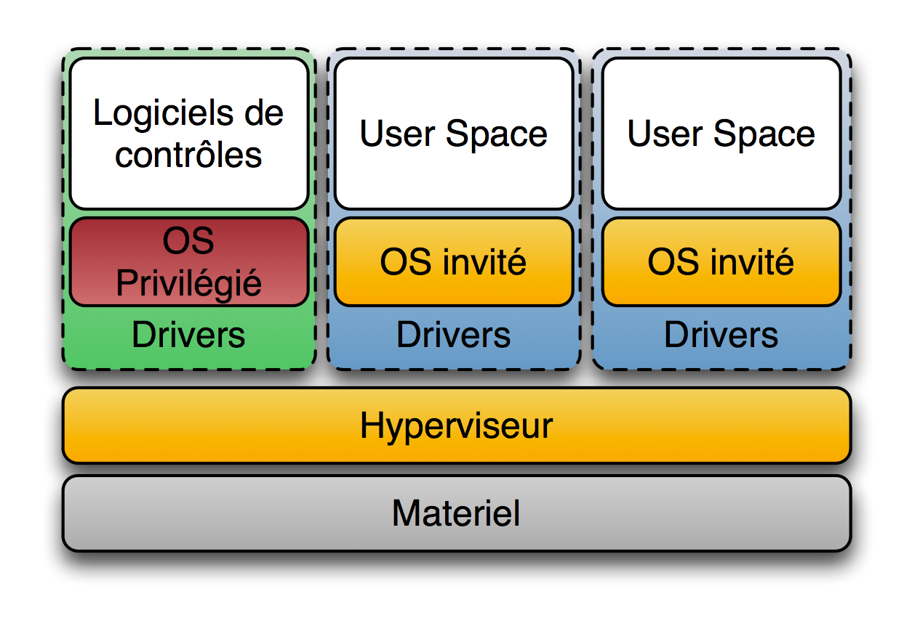

<!-- commentaire 

⇒ ∃ ≠ ≈ ⚠️

-->

## BUT 2

# Emulation / Virtualisation / Conteneurisation

## Samuel Delepoulle / Nicolas Condette

---

# Émulation

Wikimedia - CC BY-SA 3.0

- L'émulateur est un programme qui simule entièrement la machine ciblée = le logiciel se substitue à un matériel.
- Exemples :
    - émulateur de terminal (xterm émule une console VT100)
    - conception électronique = tester un microprocesseur qui n'existe pas encore
    - console de jeu (*retro-gaming*)

---

# La virtualisation c'est quoi et pourquoi ?

- Définition : faire fonctionner plusieurs systèmes sur une même machine physique comme s'ils fonctionnaient sur des machines physiques distinctes.
- Côté développement
    - Avoir un environnement de développement/test conforme à celui de production
    - Typiquement si l’on travaille sur différents projets
- Côté maintenance / déploiement
    - Mutualisation
    - Migration / installation facile
    - All-In-One : tout le nécessaire est inclus dans la Machine Virtuelle

---

# Virtualisation

- prendre en charge une abstraction de machine 
- nécessite un *moniteur de machine virtuelle* ou **hyperviseur**
- objectif : 
    - faire cohabiter plusieurs systèmes différents
    - créer un code portable pour une machine fictive (ex : machine virtuelle Java)
- Deux types :
    - type 1 : **Hyperviseur natif** = accès direct à la machine hôte sans passer par son système d'exploitation (ex : KVM)
    - type 2 : **Hyperviseur hébergé** = utilise l'environnement du système d'exploitation hôte.

---

# Virtualisation de type 2 (proche de l'émulation)

Wikimedia - CC BY-SA 3.0

- Niveau supplémentaire
- Pour faire des tests
- Exemples : Oracle Virtual Box, VMware Workstation (payant), VMWare Workstation player (gratuit) 

---

# Virtualisation de type 1 (natif)

Wikimedia - CC BY-SA 3.0

- Les systèmes (y compris l'OS de l'hôte) utilisent l'hyperviseur ⇒ nécessite adaptation de l'OS
- Les OS invités ont un accès direct à l'hyperviseur sans passer par l'OS de l'hôte.
- Nécessite que la virtualisation soit intégrée au processeur (AMD-V et Intel VT).
- Exemples : VMware ESXi et la suite vSphere, Proxmox VE (Linux KVM), Microsoft Hyper-V Server, Citrix Xen Server

---

# Conteneurs

- Conteneur = enveloppe virtuelle pour l'application et toutes les ressources nécessaires : code source, environnement d'exécution, bibliothèques, outils, fichiers

- environnements isolés (docker est un *isolateur*).
    - Comme pour une Machine Virtuelle
    - Virtualisation légère    

---

# Conteneurs

- Pas d'OS invité = on s'appuie directement sur le système hôte
- Le kernel partage les ressources du
système hôte et interagit avec le(s)
containeur(s)

    - Techniquement : Docker n'est pas une VM
    -  Utilisation : Docker peut-être apparenté à une VM.
    - Pratiquement : Docker plus rapide moins gourmand en ressources

---

# Conteneurisation

## Avantages

1. Portabilité
2. Agilité
3. Vitesse
4. Isolation des erreur
5. Efficacité
6. Facilité de gestion
7. Sécurité

## Inconvénients

1. Incompatibilité avec certaines tâches
2. Gestion et orchestration parfois délicate
3. Isolation relative

