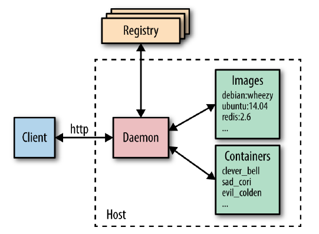
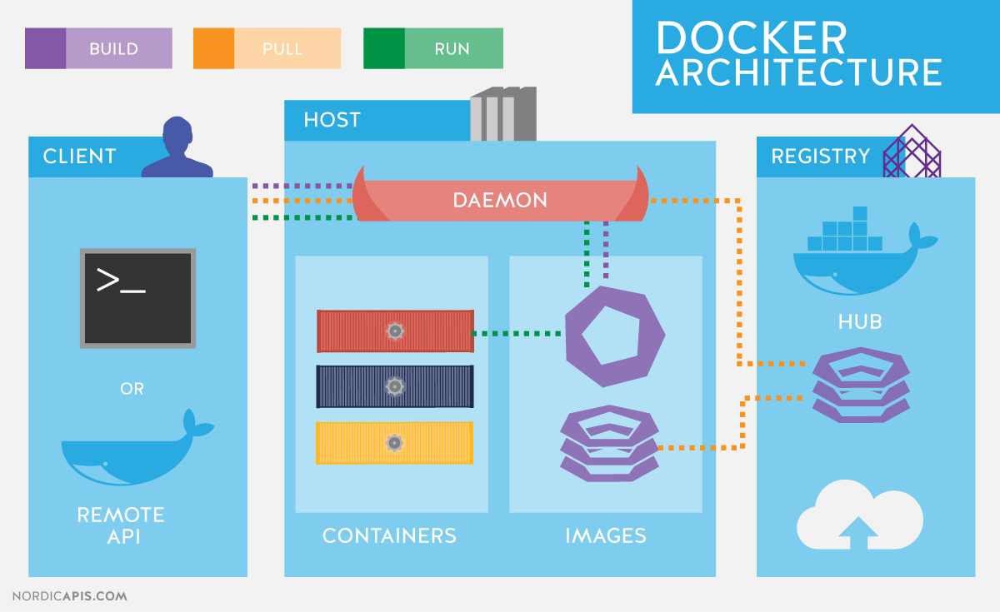

<!-- commentaire 

<div class="grid grid-cols-2 gap-4">
<div>

</div>
<div>

</div>
</div>

⇒ ∃ ≠ ≈ ⚠️


-->


## BUT 2

# Docker en pratique : cours 1 


## Samuel Delepoulle & Nicolas Condette


---

# Docker = 2 parties

<div class="grid grid-cols-2 gap-4">
<div>

## dockerd

- partie ``daemon`` = travail en arrière plan

- responsable de l'environnement d'exécution des conteneurs (docker engine)

## docker

- permet d'intéragir avec ``dockerd``

- utilise une CLI (command line interface) pour ajouter, retirer et gérer les conteneurs

</div>
<div>




</div>
</div>


---
<style scoped>
section {

  font-size: 22px;
  

}
</style>


# Installer Docker

<div class="grid grid-cols-2 gap-4">
<div>

## Linux (facile)

Utiliser les paquets du système. Exemple Ubuntu  
https://docs.docker.com/engine/install/ubuntu/

## MacOs (très facile)

Docker Desktop for MacOS
https://docs.docker.com/desktop/install/mac-install/
</div>
<div>

## Windows (pas très marrant .)
4 solutions avec avantages et inconvénients :

- Docker Desktop WSL2 https://docs.docker.com/desktop/windows/wsl/
- Docker Desktop for Windows https://docs.docker.com/desktop/install/windows-install/
- Docker Engine avec VirtualBox
- Docker Toolbox avec le driver VirtualBox
</div>
</div>


Tester avec ``docker run hello-world``


---

# Principes généraux

Toutes les commandes commencent par : 

``
docker ...
``

## Aide sur docker 

``docker help`` pour afficher toutes les commandes et paramètres

``docker commande help`` liste les "sous commandes"

``docker command --help`` liste les paramètres d'une commande / sous-commande

---

# Les images

---


# Images

Identifiées par un nom et un tag 

```repository : tag```

## lister les images

``docker images`` ou ``docker image ls`` : liste toutes les images (créées ou téléchargées)

---

# Utiliser des images


## Créer une image 

``docker build`` recherche un fichier nommé ``DockerFile`` (attention à la casse) par défaut dans le répertoire courant.

``docker build .``

``docker build -t mon_programme:1.2.3`` idem avec un tag

## Récupérer une image

Par défaut sur le DockerHub

``docker pull repo/program:tag``

--- 

# Nettoyer les images


``docker rmi image`` supprime l'image (à condition qu'elle ne soit pas utilisée)

``docker rmi image --force`` supprime l'image même si elle est utilisée

## images dangling (pendantes)

- images inutilisées / remplacées par des versions plus récentes
- prennent de la place pour rien

Pour les lister : 
``docker images -f dangling=true``

Pour les supprimer :
``docker images prune``

---

# Les conteneurs (*containers*)

Exécutent une image :

``docker run image``

= création d'un conteneur qui utilise l'image et lancement

``docker run --name NOM image``

Idem avec un nom pour le conteneur (nom par défaut sinon)

--- 

# S'informer sur les containers

``docker info``
Informations sur l'engine

``docker ps``
liste les conteneurs actifs

``docker ps -a``
liste les conteneurs actifs et inactifs avec leurs images

``docker inspect CONTAINER``
Informations sur les conteneur

# Exécuter dans un container

``docker exec -it CONTAINER bash``

---




<!-- commentaire

# Docker-compose, c'est quoi ?

- gestion de docker en CLI
    - nombreux paramètres pour lancer les containers
    - erreurs 
    - difficile de mémoriser tous les arguments
- ``docker-compose`` permet de regrouper tout l'environnement d'exécution dans un fichier = ``docker-compose.yml``  
- installation (voir <https://docs.docker.com/compose/install/>)
    - installé avec Docker Desktop (windows/mac/linux) ;
    - CLI seul : doit être installé à part (plugin de Docker ou programme indépendant).
- tutoriel sur : <https://docs.docker.com/compose/gettingstarted/>    

-->