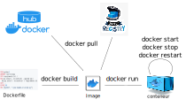

<!-- commentaire 

<div class="grid grid-cols-2 gap-4">
<div>

</div>
<div>

</div>
</div>

⇒ ∃ ≠ ≈ ⚠️


-->


## LP DIM

# Docker en pratique : cours 3
# Les environnements et les volumes


## Samuel Delepoulle 


---

# Rappel



---


## Problème 1 : envoyer des paramètres

- docker run -e (ou --env)
Ex : ``docker run  [...] -e USER="xxxxx" -e PASSWORD="xxx"``

- --env-file pour spécifier un fichier avec une liste de variables (nom de variable, valeur). 
Attention ne pas commit le .env  => gitignore

- dans le docker-compose.yml

```yaml
version: '3.8'
  services:  
    our_container:
      container_name: our_container
      hostname: our_container
      image: "environ_image"
      environment:
        - USER=XXX
        - PASSWORD=YYY
```

---

## Accéder aux variables d'environnement 

- Les variables d'environnement peuvent être lues par le conteneur
- accès dépend du langage ...

### python :
```python
# os & env
from os import environ
from dotenv import load_dotenv

load_dotenv()
username = environ['USER']
password = environ['PASS']
print("Running with user: %s" % username)
```

---

### C
```c
#include <stdio.h>
#include <stdlib.h>

int main(void) {
    char *var = getenv("PATH");
    printf("la valeur de PATH est %s\n", var );
}
```

### java
```java
System.out.println(System.getenv("USER"));
```

---

### php
```php
print "env is: ".getenv("USER")."\n";
```
ou
```php
print "env is: ".$_ENV['USER')."\n";
```

### node
```js
console.log('Hello ' + process.env.USER)
```


---

## Problème 2 : stockage des fichiers ?

## Exemple : serveur web

``docker pull nginx``

``docker run -p 80:80 nginx``

- problème : où stocker les fichiers servis ?
- image : problème = les données disparaissent si l'image est reconstruite
- solution : les volumes

---

# Les Volumes

= Mécanisme privilégier de Docker pour gérer/partager les données dans les conteneurs

Permettent de partager des fichiers/dossiers :
- entre l'hôte et les containers
- entre les containers

---

## Opérations sur les volumes

### Créer
``docker volume create my-vol``

### Lister
``docker volume ls``

### Inspecter
``docker volume inspect my-vol``

Note : par défaut, les volumes sont stockés dans ``/var/lib/docker/volumes`` du système hôte

---

### associer un volume au démarrage 


``docker run -d --name devtest -v myvol2:/app nginx:latest
``
Note : si le volume n'existe pas, il est créé

Chemins : linux = $(pwd) / cmd = %cd% / powershell = $PWD

### Mode read-only
``docker run -d --name test2 -v myvol2:/usr/share/nginx/html:ro nginx:latest``


### Vérifier que le volume est monté
``docker inspect devtest``

---

## Nettoyer

### supprimer un volume
``docker volume rm my-volume``

### supprimer les volumes inutilisés (non référencés par un conteneur)
``docker volume prune``

---

# Utiliser des volumes avec Docker-compose

```yaml
services:
  frontend:
    image: node:lts
    volumes:
      - myapp:/home/node/app
volumes:
  myapp:

```

- première exécution de ``docker-compose`` up crée le volume, les suivantes réutilisent le volume créé