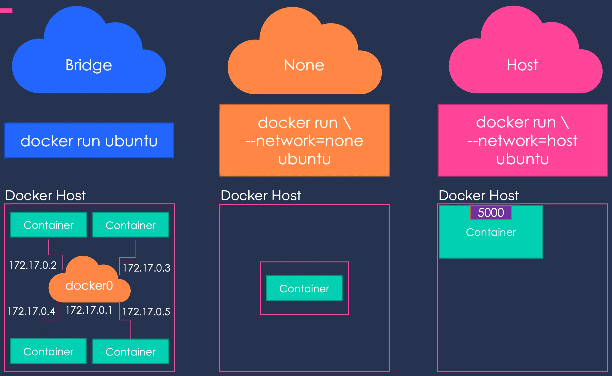
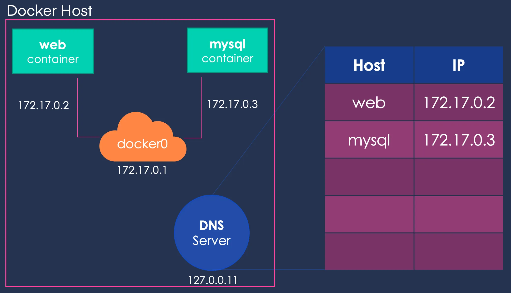
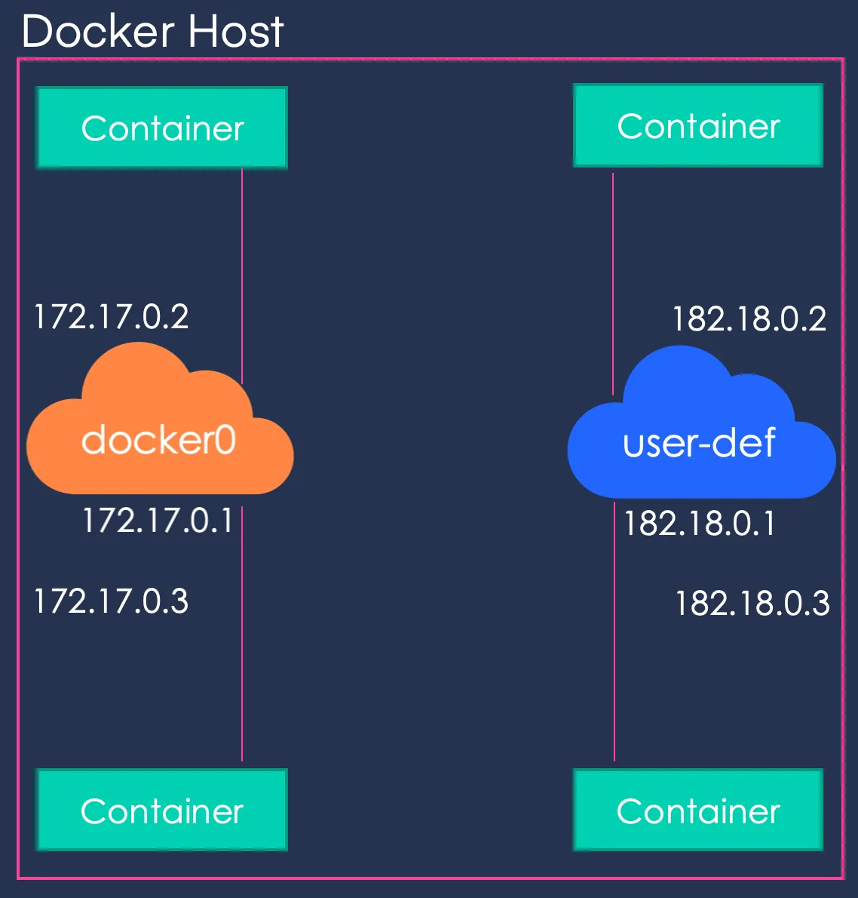

<!-- commentaire 

<div class="grid grid-cols-2 gap-4">
<div>

</div>
<div>

</div>
</div>

⇒ ∃ ≠ ≈ ⚠️


-->


## BUT 2 

# Docker en pratique : cours 4
# Les réseaux de docker


## Samuel Delepoulle & Nicolas Condette

---

# Gestion des ports (rappels)

- **exposer** : instruction ``EXPOSE`` du Dockerfile indique au conteneur qu'il écoute un port particulier (en TCP par défaut)
- **publier** : permet d'ouvrir effectivement le port (avec mappage éventuel des ports)
  - au lancement avec : ``-p <port_host>:<port_guest>`` de ``docker run``
  - avec l'instruction ``port:`` dans le ``docker-compose.yml``

```yaml
services:
  web:
    build: .
    ports:
      - "8000:8000"
  db:
    image: postgres
    ports:
      - "8001:5432"
```
---

# Réseau bridge et overlay

Docker intègre :
- serveur DNS
- serveur DHCP

Par défaut : Docker crée l'interface réseau docker0 avec l'adresse 172.17.0.1. Les conteneurs ont des adresses sur le réseau 172.17.0.0/16


---

# Types de réseaux 

- **Réseau Bridge** : (par défaut pour Docker) 
= chaque conteneur dispose d'une adresse IP unique dans le sous-réseau 172.17.0.0/16. 
Les conteneurs peuvent se connecter entre (via IP) et ils peuvent communiquer avec le monde extérieur via le port forwarding.

- **Réseau Host** = partager l'interface réseau avec l'hôte Docker. Les conteneurs ont accès aux mêmes interfaces réseau que l'hôte ⇒ ils peuvent utiliser la même adresse IP.
 ⇒ meilleures performances **mais** ne permet pas l'isolation des conteneurs.

- **Réseau Overlay** : permet aux conteneurs de communiquer entre eux sur plusieurs hôtes Docker 
(protocole VXLAN pour créer un réseau virtuel qui peut s'étendre sur plusieurs hôtes Docker)

---

# Types de réseaux (suite)

- **Réseau ipvlan**

- **Réseau Macvlan** : permet d'assigner aux conteneurs une adresse MAC
⇒ parfois utile pour des applications "legacy" qui ont besoin d'une connection directe à un réseau physique.

- **Réseau None** : Pas de réseau.
⇒ pour les conteneurs qui exécutent des tâches système spécifiques et ne nécessitent pas de connectivité réseau.


---

# Création d'un réseau (pour isoler)

```docker network create [OPTIONS] NETWORK```


# Utilisation du réseau

```option --network de docker run```

ou dans le ``docker-compose.yml`` avec l'instruction :

``network:``

## note l'instruction ``link`` est obsolète

---



---




---

```
docker network create --driver bridge --subnet 182.18.0.0/16 user-def
```



