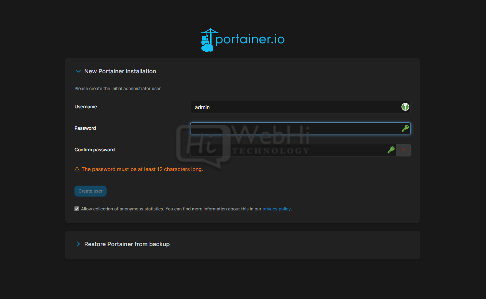
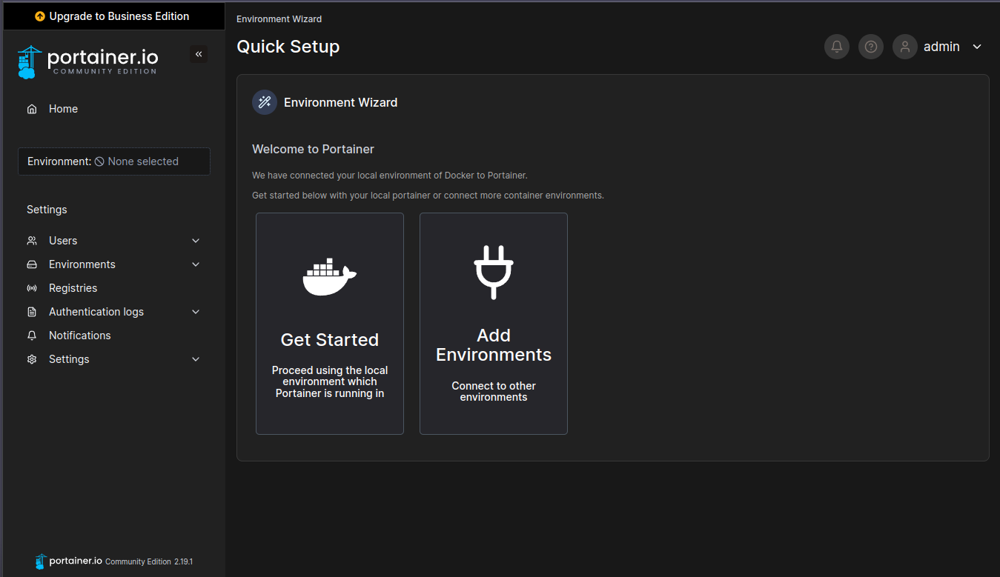
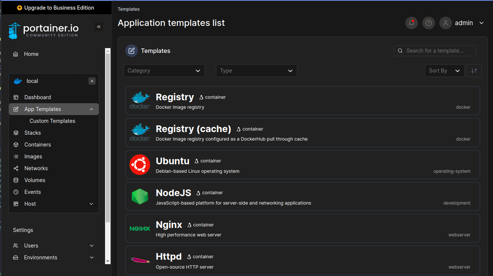
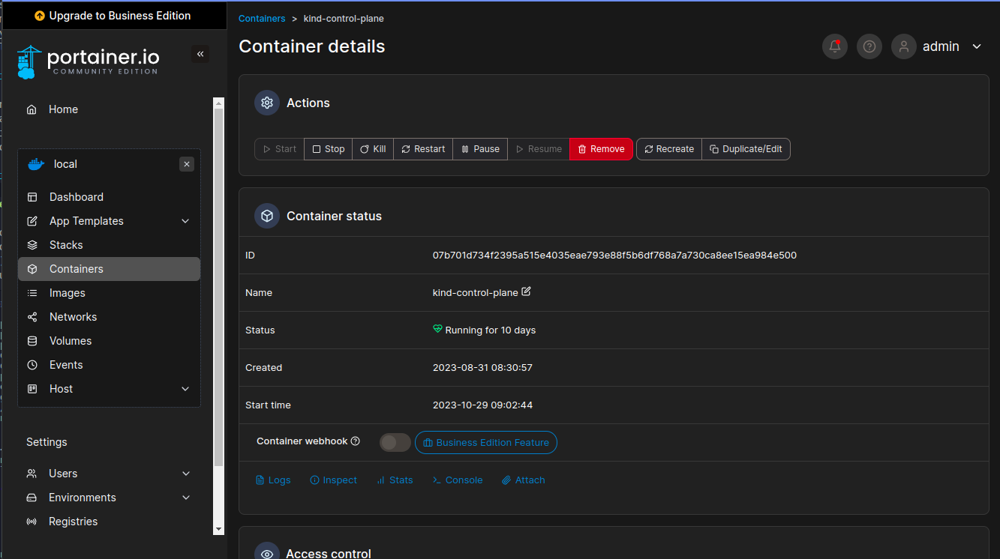
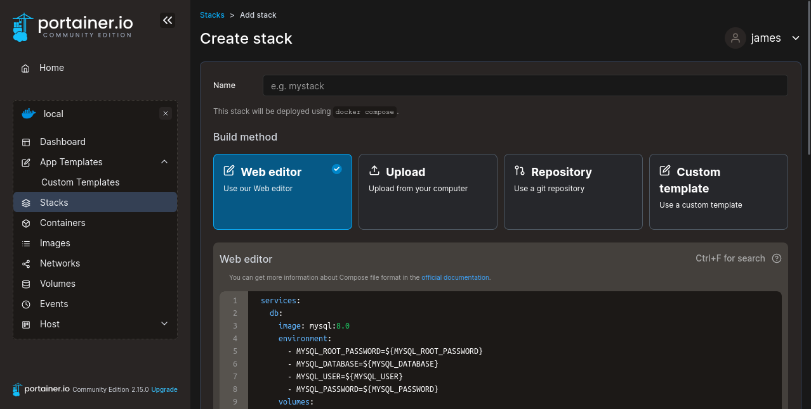
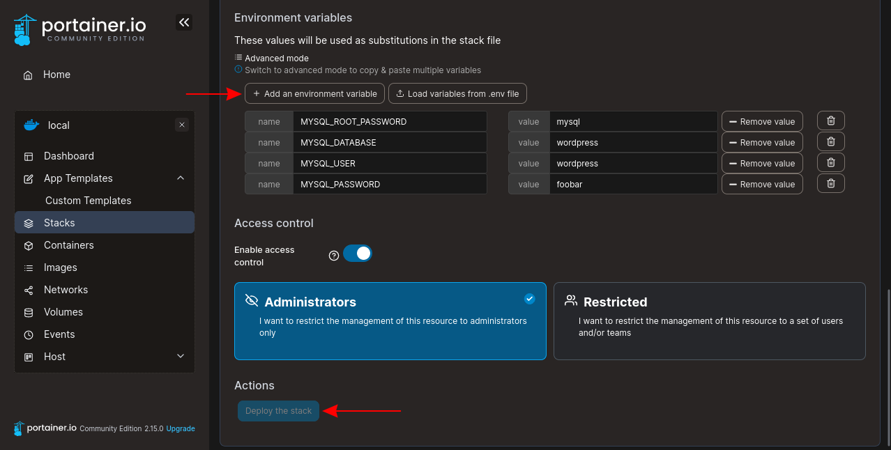
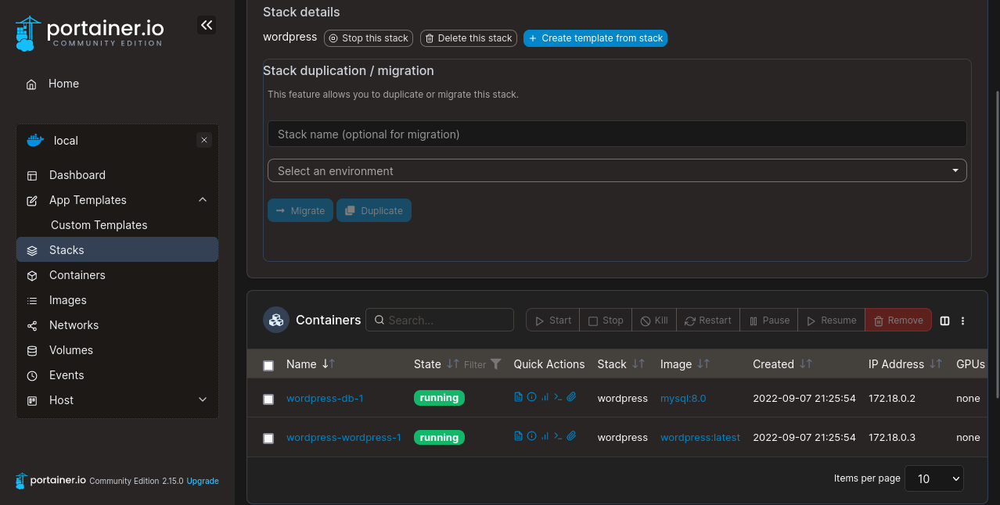

<!-- commentaire 

<div class="grid grid-cols-2 gap-4">
<div>

</div>
<div>

</div>
</div>

⇒ ∃ ≠ ≈ ⚠️


-->


## BUT 2 

# Docker en pratique : cours 5
# Portainer


## Samuel Delepoulle & Nicolas Condette

---

# Interface web

- WebUI open source pour créer, modifier, redémarrer, surveiller… des conteneurs Docker.

- Interconnecter plusieurs serveurs utilisant Docker (via Portainer Agent), afin de contrôler/surveiller les conteneurs répartis sur plusieurs serveurs depuis la même interface et cela très simplement.

---

# Installation de Portainer

Il faut créer un volume pour sauvegarder les données de portainer
```docker volume create portainer_data```

Lancement de portainer
``docker run -d -p 9000:9000 --name portainer --restart=always -v /var/run/docker.sock:/var/run/docker.sock -v portainer_data:/data portainer/portainer-ce:latest``

---


version docker-compose
```yaml
version: '3.8'
services:
  portainer:
    image: portainer/portainer-ce:latest
    ports:
      - 9000:9000
    volumes:
      - /var/run/docker.sock:/var/run/docker.sock
      - portainer_data:/data
    restart: always
volumes:
  portainer_data:
```
---

# Configuration

Lancer Portainer à l'adresse http://localhost:9000 et créer un compte admin



---

# Environnements

<div class="grid grid-cols-2 gap-4">

<div>

- Aucun environnement par défaut (local à choisir la première fois)
- Détecte docker sur lequel il est installé
- Centraliser l'administration de plusieurs serveurs de conteneurs Docker sur un seul point

</div>

<div>



</div>
</div>

---

# Catalogue d'applications (templates)

<div class="grid grid-cols-2 gap-4">

<div>

- Recherche de templates prédéfinis
- Création d'un template personnalisé
- Personnalisation de la configuration
- crée un conteneur fonctionnel en quelques instants

</div>
<div>



</div>
</div>

---

# Surveillance de l'état des conteneurs

<div class="grid grid-cols-2 gap-4">

<div>

- Vue d'ensemble complète de l'état de vos conteneurs
- Surveillance en temps réel de l'utilisation des ressources, des journaux (logs) et des statistiques de performance
- Action sur le conteneur (Start, Stop, Pause, Restart, ...)

</div>
<div>



</div>
</div>

---

# Gestion des volumes et des réseaux

Via l'interface :
- créer et gérer des volumes Docker pour stocker des données persistantes
- créer et gérer des réseaux pour connecter vos conteneurs

---

# Gestion des stacks

- Portainer nomme les Compose de Docker en stack.
- Une stack est donc une collection de services interconnectées qui fonctionnent ensemble pour prendre en charge une application.
- Les stacks sont généralement définies à l'aide de fichiers de configuration, tels que des fichiers Docker-Compose.

---

## Création d'un stack



---

## Ajout des variables d'environnement et déploiement



---

## Liste des stacks


